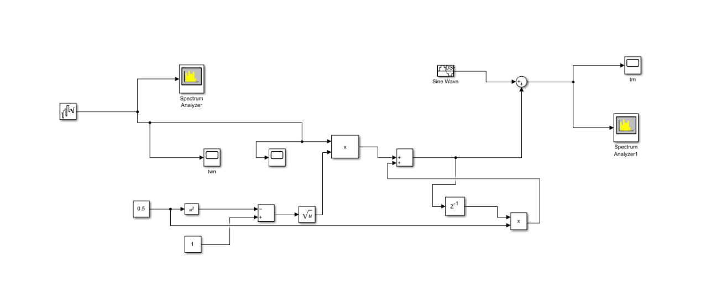

# RedNoise
This project aims to develop an algorithm for Intel Agilex FPGA Accelerator that can reduce red noise from the pulsar search data.

This is the block diagram for converting white noise into red noise.

